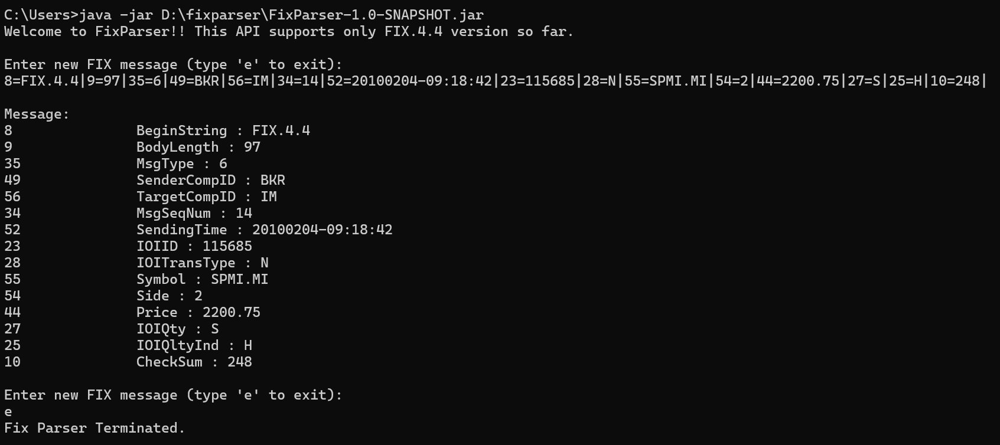
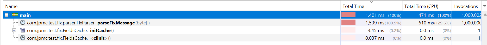

# FIX Parser API
This is a simple FIX parser command line API. This API supports only FIX.4.4 version so far.

## Content
- Developer's prologue & assumptions
- Intro and terminology
- How to use?
- Future Development Discussion

## Developer's prologue & assumptions

### Intro
This FIX parser is made to be simple with high performance and less memory footprint. 

### Assumptions
- Only FIX.4.4 version supported.
- Only valid message are supported. No validation is taken care of.
- Only covers basic FIX parsing. Messages having Repeating groups or nested groups will be simply parsed and shown. ALso any other complex FIX parsing is not taken care of.
- It returns a Stringbuilder and asks the caller to print the message. Other forms of output can be done,but for simplicity and used only in Command line , printing the string seemed a good solution.
- String builder is taken as the choice as the API is meant to be run on command line in single thread mode. 

## How to use?

### Using Command line 
Run the following command in windows command line 

`java -jar path_to_FixParser-1.0-SNAPSHOT.jar`
Program will print the welcome message and ask you to input FIX message and will print the parsed message .

Type 'e' and enter if you wish to exit the program.

Sample Screenshot

### IDE(Intellij ,eclipse etc.)

Go to `FixParserMain.java` and run the file.

## Benchmarks
Simple benchmarking has been done by calling the method repeatedly and noting the time in nanos.
### simple benchmark result
messages: 100       || totalTime(nanos): 2255700    || time/message(nanos): 22557  
messages: 10,000    || totalTime(nanos): 40849000   || time/message(nanos): 4084  
messages: 10,00,000 || totalTime(nanos): 1034561900 || time/message(nanos): 1034

### VisualVM result
Result of 1M invocation : time/Message : 1539 nanos
